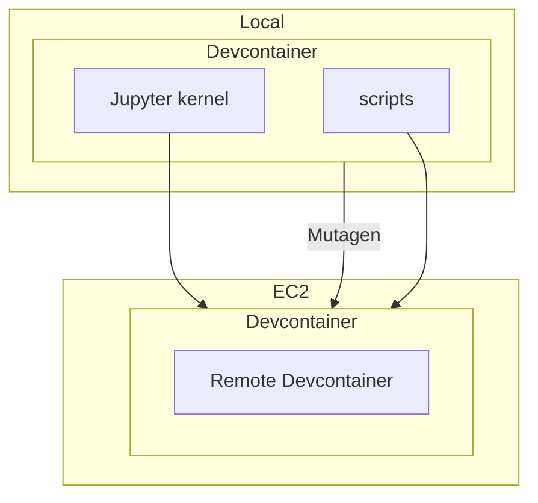

# Infrastructure

This infrastructure aims to establish a relationship to powerful computing paradigms
that cultivates deep understanding and facilitates unobstructed experimentation, customization, and control.
Applications of special interest are language models and databases.

## Language Models

To achieve the goals of this project, unobstructed access to models is required, implying exclusive use of open weight models.
It also implicitly demands infrastructure that provides the computing resources necessary
for experimentation, without being prohibitively burdensome or expensive.
The target cost profile is to use only as much compute as is necessary,
and only during the time it is needed.
The target complexity is to facilitate a mental model that abstracts the separation in compute nodes,
making remote compute indistinguishable from local compute.
Local compute is preferred, and remote compute used only as/when needed, or explicitly commanded.

There are many infrastructure options for LLM, most of which force unacceptable compromises.
For example, many infrastructure providers obfuscate details necessary for complete understanding and control.
These interfaces often prescribe a toolchain and lifecycle (e.g., hosted notebook interfaces).
Control over models and computing interfaces preserves open experimention,
and preserves the option to develop and customize interfaces that are both productive and sustainable.

This requires infrastructure that supports:

- Scalable compute
- Direct OS-level access
- Cost monitors & controls
- Modern security and isolation
- Integration with local development tools
- Support for model inference and training

### Architecture

Single-node, single-purpose EC2 instances.
Cheapest option, simplest architecture, and allows for complete customization for each use-case.
Two node categories under current consideration: Serving and Interactive

#### Serving Nodes

Serving nodes support coding agents and are defined in this repository.
Small FIM models should continue to run locally.
(TODO: design serving stack, vLLM/TGI/TensorRT-LLM/llama.cpp?)
(TODO: design local/remote routing, possible to configure this via llama.cpp?)
(TODO: design HF inference providers fallback, e.g., when node is unavailable or starting)

#### Interactive Nodes

Interactive nodes (e.g., training, experimentation) defined in the repositories they support.

- Local and remote filesystem fusion via [Mutagen project](https://mutagen.io/documentation/orchestration/projects/)
- Remote devcontainer build/start via [Finch](https://runfinch.com/)
- Local development, remote script execution
- Local Jupyter notebook, remote execution



Expected project startup:

1. Start the project devcontainer on local machine
2. Ensure the tailnode is available (`cdk deploy`)
3. Start Mutagen project session
4. Run command to build/start the remote devcontainer (via `finch`)
5. Connect via SSH / Mutagen forwarding / Jupyter remote kernel

Future:

- Tailnet training instances registered to and orchestrated by [PyTorch Monarch](https://meta-pytorch.org/monarch/stable/)

Cheapest, simplest quickest to get started.
Scales, though not entirely automated (and horizontal scaling is limited/complex?)
Consider `ec2.AutoScalingGroup`.
Meets all other needs
Possible to default to spot and switch to on-demand as needed?

## Constructs

### `Tailnode`

An EC2 instance that joins a tailnet via [Tailscale Workload Identity Federation](https://tailscale.com/docs/features/workload-identity-federation).
The instance role is granted `sts:GetWebIdentityToken` scoped to a Tailscale audience;
the Tailscale client exchanges that token for an auth key on first boot.

- **Zero ingress** — [Tailscale SSH](https://tailscale.com/docs/features/tailscale-ssh) is the only inbound path
- **[Instance Metadata](https://docs.aws.amazon.com/AWSEC2/latest/UserGuide/configuring-instance-metadata-service.html) — detailed CloudWatch metrics
- Idle auto-stop: CloudWatch alarm on `CPUUtilization` below a configurable threshold for a configurable duration → native EC2 `stop` action

[Example](./examples/tailnode/tailnode/)

## Prerequisites

### AWS Outbound Identity Federation

[Outbound identity federation](https://docs.aws.amazon.com/IAM/latest/UserGuide/id_roles_providers_outbound.html) enables an AWS account to perform outbound identity federation. This allows AWS workloads to authenticate with external services, such as Tailscale, using the AWS IAM role as the credential.

If Outbound Identity Federation is enabled, the following AWS CLI command should return successfully:

```sh
aws iam get-outbound-web-identity-federation-info | jq
```

To enable Outbound Identity Federation, run the following:

```sh
aws iam enable-outbound-web-identity-federation | jq
```

### Tailscale Tags

Create [Tailscale tags](https://tailscale.com/docs/features/tags) to associate with compute nodes.
This document uses the tag `tag:compute`.

### Tailscale Workload Identity Federation

[Tailscale Workload Identity Federation](https://tailscale.com/docs/features/workload-identity-federation) requires an admin to establish trust between Tailscale an AWS identity.
This requires the AWS Issuer URL and Subject format.

TODO: automate the below

Retrieve the AWS account issuer URL:

```sh
aws iam get-outbound-web-identity-federation-info | jq -r .IssuerIdentifier
```

The [subject is the AWS role ARN](https://docs.aws.amazon.com/IAM/latest/UserGuide/id_roles_providers_outbound_token_claims.html),
so the subject format for the EC2 instance is of the following form:

TODO: add stricter expected role name pattern

```
arn:aws:iam::<accountid>:role/*Role*
```

Only the `auth_keys` (write) scope is required, associated with `tag:compute`.

> The workload identity credential must have the `auth_keys` scope and the tags passed to `--advertise-tags` must match the tags you selected when you configured the federated identity.

- [Tailscale WIF docs](https://tailscale.com/docs/features/workload-identity-federation#register-new-nodes-using-workload-identity)

Once the federated identity is created, a client ID will be generated.
Pass it as `tailscale_client_id` in `TailnodeProps`.

### Update Tailscale ACL policy

Open the [policy editor](https://console.tailscale.com/admin/acls/file).
Merge into the the existing policy document:

TODO: automate this part

```hujson
{
  "tagOwners": {
    "tag:compute": ["autogroup:admin"],
  },
  "ssh": [
    {
      "action": "accept",
      "src":    ["autogroup:member"],
      "dst":    ["tag:compute"],
      "users":  ["root", "ec2-user"],
    },
  ],
}
```

## Alternatives

### Sagemaker

> What would the ideal arrangment look like, that supports the goals above?
Sagemaker has many deployment options and legacy / emerging options.
What would need to change for Sagemaker to become an option?

### EKS

> Likely lots of OSS options to run on EKS. (vLLM/TGI/TensorRT-LLM)
Supports a parallelism I don't need?
I wonder if the control plane would simplify managing infra and keep costs low.
I'm not starting here but when would I graduate to this?

